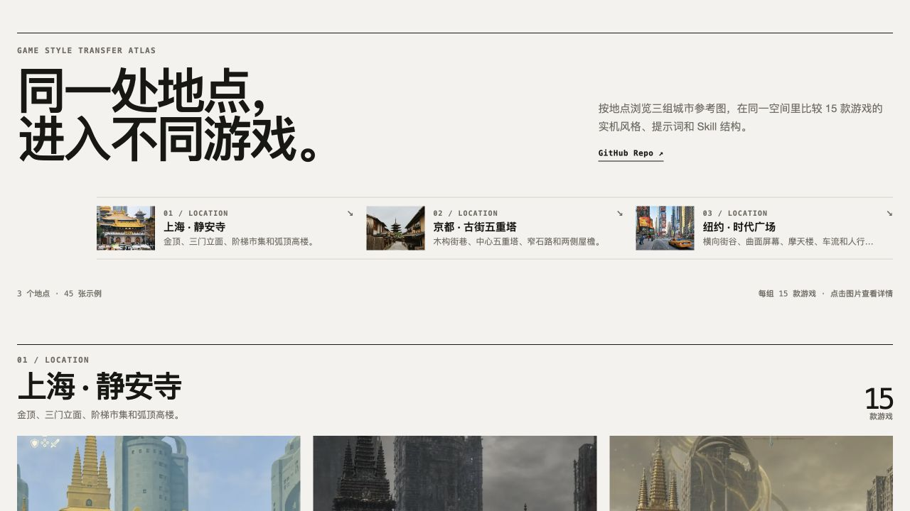

# Game Style Transfer Atlas

按地点分组，用三套城市照片比较 15 款热门游戏的视觉语言，支持原图对照、16:9 横屏、放大预览和提示词复制。

网页：[GitHub Pages](https://holynova.github.io/game-style-transfer-atlas/)

代码：[GitHub](https://github.com/holynova/game-style-transfer-atlas)

扫码：

本地运行：`npm install && npm run dev`
