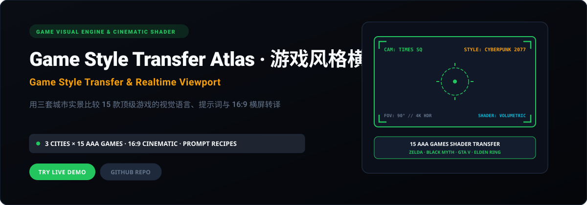
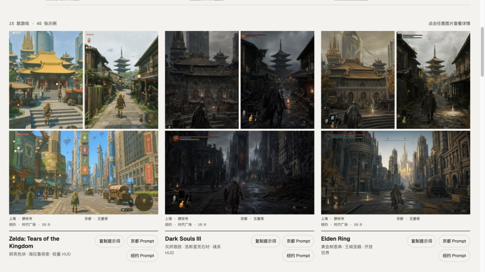

<p align="right">
  <strong>简体中文</strong> · <a href="./README.en.md">English</a>
</p>

<p align="center">
  
</p>

<p align="center">
  <a href="https://game-style-transfer-atlas.xiaosang.cc/"><strong>🌐 在线体验 (Live Demo)</strong></a> · 
  <a href="https://holynova.github.io/game-style-transfer-atlas/"><strong>🚀 备选镜像 (GitHub Pages)</strong></a> · 
  <a href="https://github.com/holynova/game-style-transfer-atlas"><strong>📦 GitHub 源码</strong></a> · 
  <a href="https://xiaosang.cc/"><strong>✨ 更多作品集</strong></a>
</p>

---

## 真实预览 (Proof of Work)

<p align="center">
  
</p>

---

## 项目简介 (What It Is)

以游戏主机 HUD 视窗与概念美术为灵感打造的实机画风转译图鉴。选取纽约时代广场、京都街巷、上海高架三组真实城市照片，将其精确转译为《赛博朋克2077》《塞尔达传说》《黑神话：悟空》《GTA V》《暗黑破坏神》等 15 款知名游戏的实机视觉风格。

---

## 核心机制与特色 (Why It Matters)

- **16:9 电影级横屏取景**：还原次世代游戏主机的原生视窗视野，自带 HUD 瞄准准星与参数信息卡。
- **真实照片基准比对**：采用原片与转译图无缝并排滑块对比，直观展现材质、光影、着色器与氛围重塑。
- **15 款 AAA 游戏着色解构**：深入解析次表面散射、体积雾、卡通渲染 (Cel-shading)、像素噪点等核心管线。
- **一键提取游戏提示词**：每套风格配套完整的 AI 作图提示词配方，精准复刻目标游戏的光影与构图。

---

## 收录清单与规格 (Inventory & Scope)

15 款热门游戏视觉模型（赛博朋克2077、黑神话、塞尔达传说、GTA V、辐射、艾尔登法环等）、3 组地标实景图、16:9 画幅放大灯箱。

---

## 快速开始 (Quick Start)

### 1. 在线体验
无需安装任何环境，直接在浏览器中打开：
- 🌐 **主站演示 (Primary)**：[https://game-style-transfer-atlas.xiaosang.cc/](https://game-style-transfer-atlas.xiaosang.cc/)
- 🚀 **备选镜像 (GitHub Pages)**：[https://holynova.github.io/game-style-transfer-atlas/](https://holynova.github.io/game-style-transfer-atlas/)

### 2. 本地运行与调试
克隆仓库后执行以下命令：

```bash
git clone https://github.com/holynova/game-style-transfer-atlas.git
cd game-style-transfer-atlas
npm install && npm run dev
```

---

## 开源协议与作者 (License & Author)

- **作者**：[holynova (小桑)](https://xiaosang.cc/)
- **授权协议**：[MIT License](./LICENSE)
- **合辑收录**：本仓库作为精选项目收录于 [Where Craft Lives (xiaosang.cc)](https://xiaosang.cc/)。
